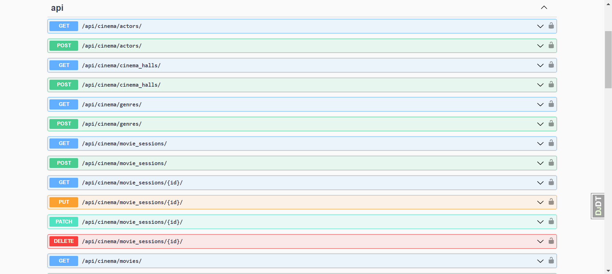
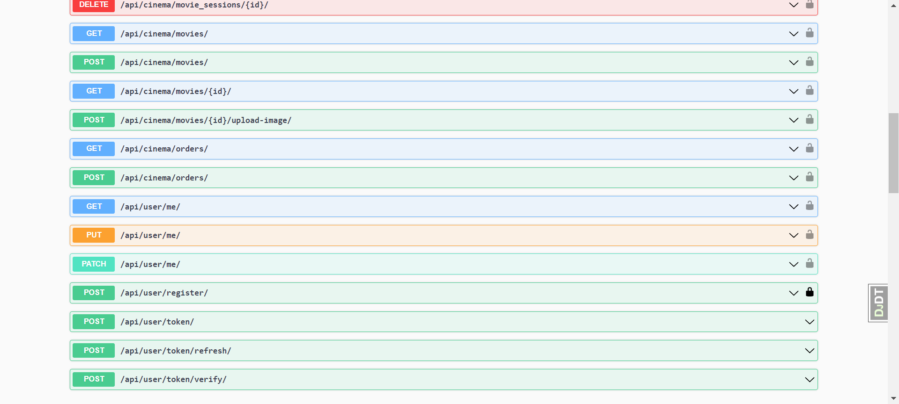
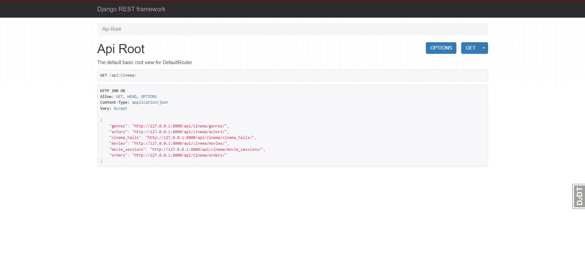

# Cinema API
The application was created on DRF for convenient management of cinemas.

## Installing / Getting started:
```shell
To get started, you need to clone the repository from GitHub: https://github.com/Morty67/DRF-Cinema-API
Python 3 must be installed

cd config
python -m venv venv
venv\Scripts\activate (on Windows)
source venv/bin/activate (on macOS)

pip install -r requirements.txt

Your settings for DB in .env file:
POSTGRES_DB=<POSTGRES_DB>
POSTGRES_USER=<POSTGRES_USER>
POSTGRES_PASSWORD=<POSTGRES_PASSWORD>
POSTGRES_HOST=<POSTGRES_HOST>
SECRET_KEY=<SECRET_KEY>

python manage.py migrate
python manage.py runserver
```
## Run Docker
Docker must be installed 
```shell
*  docker-compose build
*  docker-compose up
```
## How to get access

Domain:
*  localhost:8000 or 127.0.0.1:8000
*  create new user - api/user/register/
*  get JWT Token - api/user/token/

## Features:

*  JWT authenticated
*  Admin panel - admin/
*  Documentation is located at api/doc/swagger/
*  Managing  movies with genres, actors
*  Creating cinema halls
*  Adding movie sessions 
*  Filtering movies and movie sessions

## Demo



